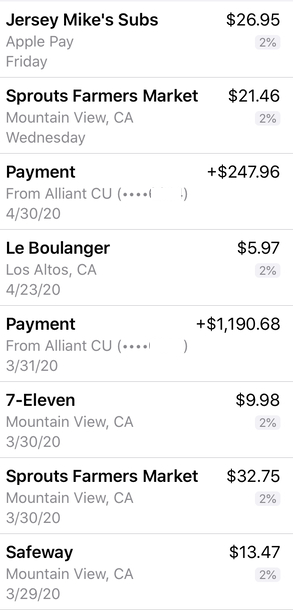
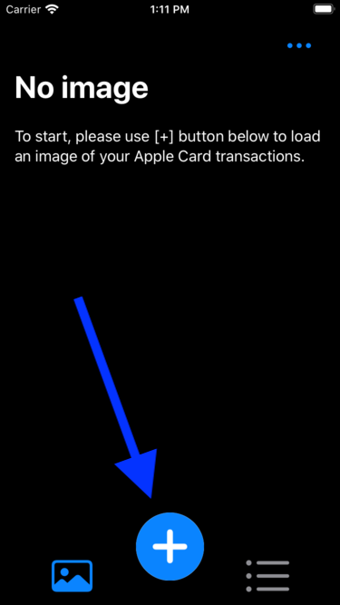
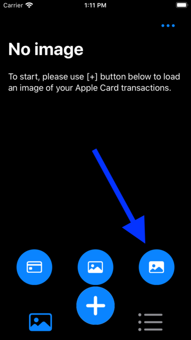
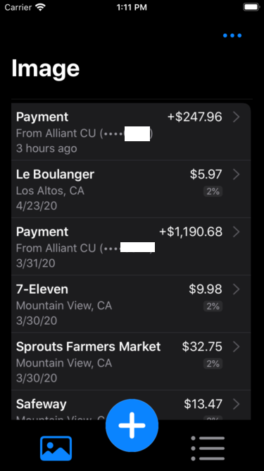
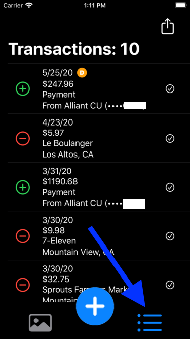
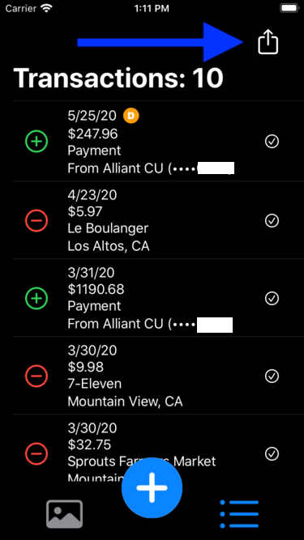
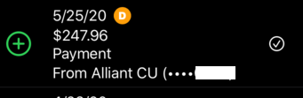

# Welcome to TransactQ
### On demand Apple Card transactions to QFX converter

TransactQ makes it possible for Apple Card owners to generate an on demand QFX file for their transactions. 

In just a few steps, you will be able to import your Apple Card transactions into your personal finance software such as Quicken. You can do this as soon as the transaction shows up in your phone Wallet. No longer you have to wait for the end-of-the-month statement.

## To use the app

### Take a screenshot
Take a screenshot of the transactions. Crop it down to the list of transactions. Best to exclude the logo on the left side and the right arrow on the right side.

### Load screenshot
Open app and load the screenshoot of the transactions.

### Screenshot loaded
Once the screenshot is loaded, It will be processed and converted in to text. Then it will be parsed into a transaction list.

### View as transaction list

### Share
You can share the transaction list as QFX file 
  * send as attachement in an email
  * save to file
  * AirDrop to your desktop 

## Tips

* Crop the screenshot to include only the transacions. Make sure to exclude 
  ** the logo on the left side
  ** and the '>' characters on the right side
* You can exclude a transaction from the OFX file by uncheck a checkmark. You might want to do that if you notice that the 
transaction might have incorrect information.
* If the app has problem recognizing some of the texts, increase screen brightness when taking the screenshot.
* If there is a letter (D) next to the date. That means the date was derived from text string as such as '2 hours ago' 
or 'Wednesday'. In such case, the date might be different depending on when you generate the OFX file. 

