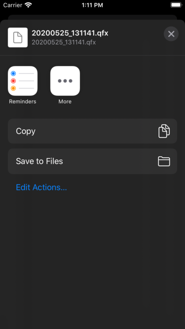

# TransactQ - On-demand Apple Card transactions to QFX converter

This app makes it possible for Apple Card owners to generate on-demand QFX file for their transactions. 

In just a few steps, you will be able to import your Apple Card transactions into your personal finance software such as Quicken. You can do this as soon as the transaction shows up in your phone Wallet. No longer you have to wait for the end-of-the-month statement.

To use the app

## Take a screenshot
Take a screenshot of the transactions. Crop it down to the list of transactions. Best to exclude the logo on the left side and the right arrow on the right side.

## Load image
Use app to load the screenshoot of the transaction

## Image loaded
Image is loaded and will be processed to converted in to text and parsed into transaction list

## View as transaction list

## Share

## Share 

## Share 2

## Menu

