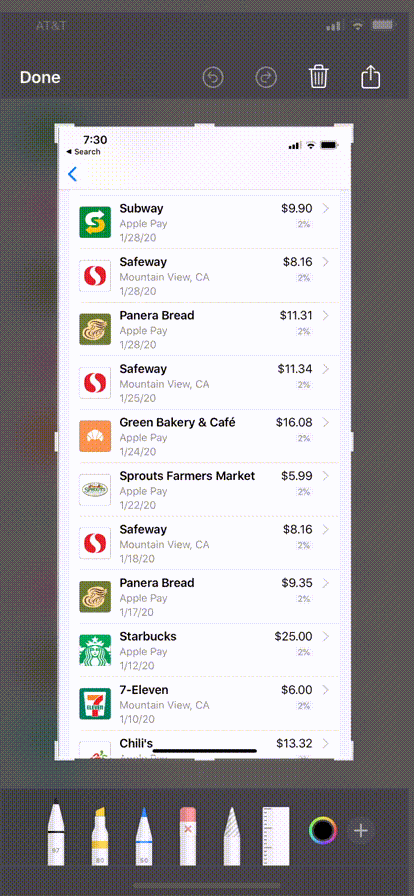

# Welcome to TransactQ (MacOS version)

- [Welcome to TransactQ](#welcome-to-transactq)
	* [What](#what)
	* [How](#how)
		+ [Step by step](#step-by-step)
	* [Tips](#tips)
	* [FAQ](#faq)
	* [About us](#about-us)
	* [Privacy Policy](#privacy-policy)
- [iOS version](../)

MacOS version is currently in Beta Testing.

## What
Tired of waiting until the end of the month for your Apple Card QFX/QBO/OFX file?
Wait no more.
This app makes it possible for Apple Card owners to generate a QFX file of their **recent ("Latest Transactions") transactions**.

## How
A typical workflow

1.  On iPhone, open Wallet, take a screenshot of recent transactions.
2.  Share (save/airdrop) the screenshot to your laptop
3.  Open 'TransactQ' app. Drag-and-drop screenshot onto the app main window.
4. Open the generated file to import transacions into your personal finance software (such as Quicken)



### Step by step
1.  Open Wallet. Scroll down to the list of "Latest Transactions"
2. Take a screenshot
3. Crop the view to the list of transactions that you want to export. **Tip**: Make sure to crop out the logo's on the left side and the '>' on the right side.
4. Select to "Share" the screenshot using the  button on the top right corner to get your screenshot to your laptop.
5.  Open 'TransactQ' app. Drag-and-drop screenshot onto the app main window.
6. Use button "Show" or "Open" to open the generated file to import your transactions into your personal finance software (such as Quicken)

## Tips
* Make a good screenshot
	* crop out the logo's on the left side and the '>' on the right side of the list
	* screen contrast is not too low. Increase the screen contrast value if it appears the app failed to convert text correctly.
* Use your screenshot right away. While you can take a screenshot and open later, it is best to take a screenshot and use it right away. The Wallet "Latest Transactions" might have relative date/time text such as "2 hours ago". Those texts will have value relative to when you open the screenshot rather than at the time of the screenshot.

### Cropping the transaction list

## FAQ
Q. **I thought Apple Wallet can export QFX file**.

A. Currently, Apple will only export the QFX file for transactions from your monthly statement. This means recent transactions are not available to be exported.

Q. **How to contact you**?

A. Email to <app.projectq@gmail.com>

Q. **Will it work with Wallet in dark mode**?

A. Yes

Q. **Why some transactions are not selected for export to QFX**?

A. Transactions with 'Pending' are not selected because they are likely to be changed again. Just wait until those transactions are no longer 'Pending'.

## About us
Hi there,

We are a team of three: father (Hung), daughter (Amanda), and son (Chris).

I work as a software engineer in Silicon Valley, and Amanda and Chris are seniors in high school.

This product first started out as a one-weekend project for personal use. Then I got a few emails inquiring about it. Soon, it became quite clear that I need to treat this as a release product: it needs to be built, QA’ed, packaged, and released properly. I also need to create a web site, get the word out, handle customer emails … Then it dawned on me that this project would be a perfect vehicle to introduce my daughter and son to what it is like to create a product, market it, support it and interact with paying customers. And that is how Amanda and Chris got involved!

We strive to make you a happy customer.

We make sure our product is well-tested and works correctly for the first time. On our website, we clearly explain what our product does. If you have questions or concerns, we will give your email our full attention and get back to you promptly.

Thank you for your support,

Hung/Amanda/Chris

## Privacy Policy
TransactQ (“we” or “us” or “our”) respects the privacy of our users (“user” or “you”). This
Privacy Policy explains how we collect, use, disclose, and safeguard your information when
you use our mobile application (the “App”) or our website https://app-projectq.github.io/projectq-page/
(collectively, the “Site”). Please read this Privacy Policy carefully. IF YOU
DO NOT AGREE WITH THE TERMS OF THIS PRIVACY POLICY, PLEASE DO NOT ACCESS
THE APP.

We reserve the right to make changes to this Privacy Policy at any time and for any reason.

We do not collect information about you. The screenshot you open in our app is kept locally on your device. The generated QFX file is also kept locally on your device.

We may request access or permission to certain features from your mobile device, including
your mobile photo, and other features. If you wish to change our access or
permissions, you may do so in your device’s settings.

Our app is not intended for children under 13 years of age. No one under the age of 13
may provide any personal information to, or on, the Website. We do not knowingly collect
personal information from children under 13. If you are under 13, do not use or provide any
information on this Website, or on or through any of its features/functionality, make any
purchases through the Website, use any of the interactive or public comment features that
may be available on this Website, or provide any information about yourself to us, including
your name, address, telephone number, e-mail address or any screen name or username
you may use.

If we learn that we have collected or received personal information from a child under 13
without verification of parental consent, we will delete that information. If you believe we
might have any information from or about a child under 13, please contact us at
<app.projectq@gmail.com>.

By using our site or app, you consent to our privacy policy.

If you have questions or comments about this Privacy Policy, please contact us at:
<app.projectq@gmail.com>.
